# **MVTRX**: Bittensor SN79<!-- omit in toc -->
# Dashboard Guide<!-- omit in toc -->

This document serves to provide details on the data displayed at the [MVTRX dashboard](https://taos.simulate.trading).

- [Validator Page](#validator-page)
  - [Validator Info](#validator-info)
  - [Scoring Config](#scoring-config)
  - [Simulation Config](#simulation-config)
  - [Fee Policy](#fee-policy)
    - [Fee Parameters](#fee-parameters)
    - [Maker-Taker Ratio Chart](#maker-taker-ratio-chart)
  - [Trade Data](#trade-data)
    - [Trade Price Plot](#trade-price-plot)
    - [Trade Quantity Plot](#trade-quantity-plot)
    - [Trades Table](#trades-table)
  - [Books Table](#books-table)
  - [Agents Table](#agents-table)
  - [De-beta Scoring](#de-beta-scoring)
  - [Incentives Plot](#incentives-plot)
- [Book Page](#book-page)
  - [Book Info](#book-info)
  - [Trade Data](#trade-data-1)
    - [Trade Price Plot](#trade-price-plot-1)
    - [Trade Quantity Plot](#trade-quantity-plot-1)
    - [Trades Table](#trades-table-1)
  - [Orderbook Data](#orderbook-data)
    - [Best Levels Plot](#best-levels-plot)
    - [Depth Plots](#depth-plots)
  - [Agents Table](#agents-table-1)
  - [De-beta Book Panels](#de-beta-book-panels)
  - [Dynamic Fee Rates Plot](#dynamic-fee-rates-plot)
- [Agent Page](#agent-page)
  - [Agent Info](#agent-info)
  - [Trades Table](#trades-table-2)
  - [Score Plot](#score-plot)
  - [Performance Plot](#performance-plot)
  - [Requests Plot](#requests-plot)
  - [GenTRX Plots](#gentrx-plots)
  - [Daily Volume Plot](#daily-volume-plot)
  - [Round-Trip Volume Plot](#round-trip-volume-plot)
  - [Realized PnL Plot](#realized-pnl-plot)
  - [De-beta Scoring](#de-beta-scoring-1)
  - [Unrealized Profit \& Loss Plots](#unrealized-profit--loss-plots)
  - [Last Fee Rate](#last-fee-rate)
  - [Balances Plots](#balances-plots)
- [GenTRX Page](#gentrx-page)
  - [Status](#status)
  - [Miners](#miners)
  - [Training Progress](#training-progress)
  - [Per-Miner Performance](#per-miner-performance)
  - [Diagnostics](#diagnostics)

## Validator Page
The main page at which visitors to the dashboard land is the Validators page.  This page displays overview data for the simulation hosted by each sn79 validator.

### Validator Info
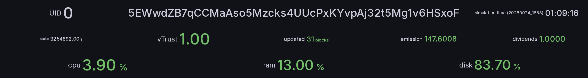

The top part of the dashboard page displays basic details of the selected validator.

The first row just indicates the UID, hotkey address and current simulation time.

The second row contains metagraph data for the validator - stake, vTrust, last update, emission and dividends.  See the [bittensor documentation](https://docs.learnbittensor.org/subnets/metagraph) for details on the meaning of these variables.

The third row displays the current resource usage of the validator hosting instance.

### Scoring Config

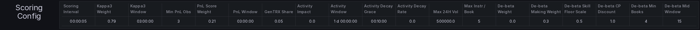

The first config table displays the parameters that govern how miners are scored.  See the [scoring note](https://github.com/taos-im/mvtrx-docs/blob/main/notes/2026-09-incentive-metric/notes-on-the-incentive-metric-of-mvtrx.md) for the formulas.

- **Scoring Interval** - How often (in simulation time) the validator runs a scoring and weight-update cycle.

- **Kappa3 Weight** - Weight of the Kappa3 Score in the trading score.  Kappa3 Weight + PnL Score Weight + De-beta Weight = 1.  0 since 0.6.2.

- **Kappa3 Window** - Rolling window (simulation time) over which Kappa3 is computed; the de-beta legs use the same window.

- **Min PnL Obs** - Minimum non-zero realized PnL observations a book needs to carry a Kappa3 value.

- **PnL Score Weight** - Weight of the PnL Score in the trading score.

- **PnL Window** - Rolling window over which realized PnL is evaluated for the PnL Score.

- **GenTRX Share** - Fraction of the overall weight allocated to GenTRX; the remainder is the trading side.  Same value as **Pool Share** on the [GenTRX Page](#gentrx-page).

- **Activity Impact** - How much traded volume raises a book's activity factor above 1.  At 0 the factor is 0 before a book's first round trip and 1 after it.

- **Activity Window** - Rolling window of round-trip volume used by the activity factor.

- **Activity Decay Grace** - Time after a book's last round trip before activity decay starts.

- **Activity Decay Rate** - Rate at which an inactive book's activity factor decays; 0 disables decay.

- **Max 24H Vol** - Cap on an agent's 24-hour traded volume per book; once exceeded, the agent's further instructions on that book are dropped for the rest of the window.

- **Max Instr / Book** - Maximum order instructions an agent may submit per book per scoring step; the excess is rejected.

The **De-beta** parameters follow.  Since 0.6.2 the trading pool is paid from the two de-beta legs directly: the making half in proportion to each miner's making credit, and the skill half in proportion to net alpha among the miners that qualify.  The published De-beta Score, `w_make x rank+(making) + (1 - w_make) x rank+(skill)` where `rank+` ranks positive values among themselves and gives non-positive values 0, summarises the two legs.

- **De-beta Weight** - Share of the trading score carried by de-beta: `trading = Kappa3 Weight x Kappa3 Score + PnL Score Weight x PnL Score + De-beta Weight x De-beta Score`.  0 is the rehearsal rung (legacy emissions, decomposition published); 1.0 is full replacement, the only value at which the Kappa3 computation is skipped.  1.0 has been the default since 0.6.2.

- **De-beta Making Weight** - `w_make`: the making leg's share of the de-beta score; the skill leg takes the remainder.

- **De-beta Skill Floor Scale** - Scale on the board-wide median |alpha| over books with fills that sets the floor below which a book does not count toward the skill leg.  0, the default since 0.6.2: a size-neutral hurdle (`scoring.debeta.skill_hurdle_bps`) decides which books count instead.

- **De-beta CP Discount** - Strength of the counterparty-concentration discount on the making leg (1.0 = full strength).

- **De-beta Min Books** - Activation guard: when fewer than this many miners have a positive de-beta score in a cycle, that cycle falls back instead of scoring the board.  The bar a miner must clear to be paid from the skill half is the Skill Bar Share below.

- **De-beta Mid Window** - Half-window, in prints, of the centred mid used as the spread-capture reference (15 means 31 prints).

- **Making Basis** - From 0.6.3: the basis the making half pays on, `realized` (captured credit scaled by markout quality, the default) or `captured`.

- **Making Horizon (s)** - From 0.6.3: simulation seconds after a fill at which its realized spread is read (20 by default).

- **Tether Multiple** - From 0.6.3: how many times a maker's credit from the background market its credit from other miners may count for (4 by default).

- **Class Weights** - From 0.6.3: each asset class's share of each half of the trading pool, in book order (`0.95,0.05` at launch).

- **Skill Bar Share** - The skill bar as a share of the books scored (`0.15625`: 20 of 128, and from 0.6.3 15 of 96 and 5 of 32 per class).

- **Skill Hurdle (bps)** - The alpha a book needs, in basis points of the miner's traded notional on it, to count toward skill (2.3 by default).

The remaining columns (Duration, Publish Interval, Init Period, precisions, agent counts and weights, Start Wealth) mirror the simulation config table.

### Simulation Config

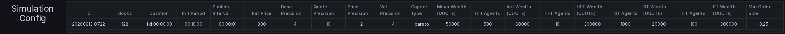

The second config table covers the simulation setup, one row per asset class (a single row on a single-market simulation).

- **Class** - The asset class the row describes (`simulation_0`, `simulation_1`).

- **Books** - The range of book ids the class covers (`0-95`, `96-127`).

- **Duration** - Total simulation runtime in simulation time.

- **Init Period** - Initial warm-up/stabilization period before miner agents are able to participate.

- **Publish Interval** - Frequency at which state updates are published to miners.

- **Init Price** - Starting price for assets at beginning of simulation.

- **Base Precision** - Decimal places for BASE quantities.

- **Quote Precision** - Decimal places for QUOTE quantities.

- **Price Precision** - Decimal places for price values.

- **Vol Precision** - Decimal places for volumes.

- **Capital Type** - Distribution method for initial capital allocation.

- **Miner Wealth (QUOTE)** - Initial total value of assets allocated to each miner agent.

- **Init Agents** - Number of initialization agents present in the simulation.

- **Init Wealth (QUOTE)** - Initial wealth allocated to each initialization agent.

- **HFT Agents** - Number of high-frequency trading agents.

- **HFT Kappa** - Quoting intensity of the class's high-frequency background market makers; a lower value quotes further from the mid.  It is the most visible of the background parameters that differ between the classes: `simulation_1`'s market makers quote far less tightly.

- **HFT Wealth (QUOTE)** - Total initial capital allocated to each HFT agent.

- **ST Agents** - Number of stylized trading agents.

- **ST Wealth (QUOTE)** - Total initial capital allocated to each stylized trading agent.

- **FT Agents** - Number of fundamental trading agents.

- **FT Wealth (QUOTE)** - Total initial capital allocated to each fundamental trader.

- **Min Order Size** - Smallest order quantity the engine accepts, in BASE; smaller orders are refused.  It differs by class: 0.25 on `simulation_0`, 2.5364 on `simulation_1`.

The **asset** selector at the top of the page limits the Trade Price plot to the books of one class.

### Fee Policy
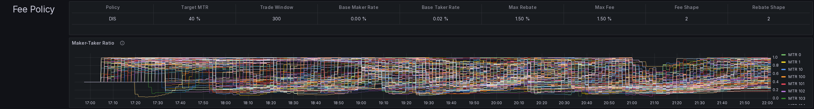

The next section displays configuration parameters for the fees applied in the simulation, as well as a visualization of the central parameter determining the fees in the [Dynamic Incentive Structure (DIS)](https://simulate.trading/taos-im-dis-paper) fee mechanism.

#### Fee Parameters

- **Class** - The asset class the fee policy applies to; each class carries its own, and the row follows the asset-class selector.

- **Policy** - Fee structure model being applied (e.g., DIS - Dynamic Incentive Structure).

- **Target MTR** - Target maker-to-taker ratio, the desired proportion of maker trades to taker trades executed by miner agents.

- **Trade Window** - Time window (in seconds or time units) used for calculating MTR.

- **Base Maker Rate** - Baseline fee rate charged on maker trades.

- **Base Taker Rate** - Baseline fee rate charged on taker trades.

- **Max Rebate** - Maximum rebate percentage.

- **Max Fee** - Maximum fee percentage.

- **Fee Shape** - Parameter controlling the evolution of fee values.

- **Rebate Shape** - Parameter controlling the evolution of rebate values.

#### Maker-Taker Ratio Chart 

This provides a visual representation of the maker-to-taker ratio over time across all the simulated books.  The fees applicable to trades are dependent on the MTR: divergences from the target towards higher maker ratio incur fees on makers during trades while takers receive a rebate, and if there is a higher proportion of trades where miner agents are the taker then makers will receive rebate while takers pay a fee.

### Trade Data

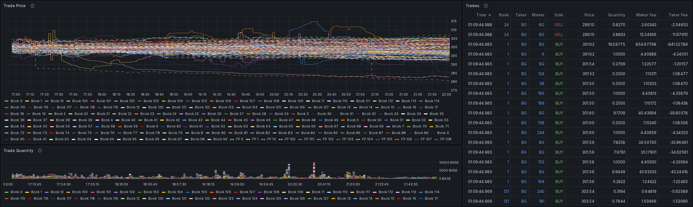

The next row contains information and visualizations related to trading activity throughout the simulation.  

#### Trade Price Plot
The Trade Price plot displays the history of last traded prices for all books, along with the fundamental price value for each.  The fundamental value is an internal variable associated with each book which contributes to the evolution of the price series.

#### Trade Quantity Plot
The Trade Quantity plot illustrates the total quantity traded in the last interval at the time the trade price was published.

#### Trades Table
The Trades table shows details of the latest 25 trades on each book:

- **Time** - Simulation timestamp of when the trade was executed.

- **Book** - Order book identifier where the trade occurred.  Note that clicking on the book ID here will redirect to the Book details page for that orderbook.

- **Taker** - Agent ID of the taker (the agent whose order removed liquidity), or `BG` when it was a background agent.  Note that clicking on the agent ID here will redirect to the Agent details page for that UID.

- **Maker** - Agent ID of the maker (the agent whose order provided liquidity), or `BG` when it was a background agent.  Note that clicking on the agent ID here will redirect to the Agent details page for that UID.

- **Side** - Direction of the taker's order (BUY or SELL).

- **Price** - Execution price at which the trade occurred.

- **Quantity** - Amount of base asset traded in the transaction.

- **Maker Fee** - Fee charged to or rebate earned by the maker agent (negative value indicates rebate).

- **Taker Fee** - Fee charged to or rebate earned by the taker agent (negative value indicates rebate).

### Books Table

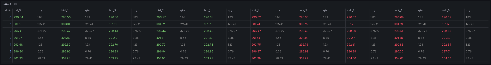

The Books table displays the current state of the top 5 levels of each orderbook:

- **id** - Unique identifier for the order book.  Note that clicking on the book ID here will redirect to the Book details page for that orderbook.

- **bid_5, bid_4, bid_3, bid_2, bid_1** - Price levels for the top 5 bids (buy orders), with bid_1 being the best (highest) bid.

- **qty** - Quantity available at each corresponding bid price level.

- **ask_1, ask_2, ask_3, ask_4, ask_5** - Price levels for the top 5 asks (sell orders), with ask_1 being the best (lowest) ask.

- **qty** - Quantity available at each corresponding ask price level.

### Agents Table

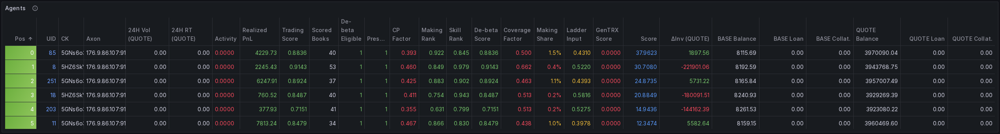

The Agents table provides summary performance information for all miners in the subnet.  Values are all aggregated over all books.

- **Pos** - Ranking position of the agent based on final score.  Sorted ascending by default.

- **UID** - Unique identifier for the agent (the miner UID).  Clicking it opens the Agent page for that UID, carrying the row's run and wallet context.

- **CK** - The agent's coldkey, truncated to its first characters; the full key shows on hover.

- **Axon** - The agent's registered axon as `ip:port`, truncated to the IP; the full value shows on hover.

- **24H Vol** - The agent's total trading volume in QUOTE asset over the last 24 simulation hours for whichever book they traded in the least.

- **24H RT (QUOTE)** - The agent's total round-tripped volume in QUOTE asset over the last 24 simulation hours for whichever book they traded in the least.

- **Activity** - Mean per-book activity factor: 0 for a book never round-tripped, 1 once it has been, above 1 only with a volume-impact setting.

- **Realized PnL** - Realized Profit and Loss from closed positions over the latest assessment window in QUOTE asset.

- **Median Kappa3** - Median of Kappa3 ratio values over all books.

- **Penalty** - Outlier penalty factor applied to the agent's Kappa3 Score due to inconsistent realized performance in one or more books.

- **Kappa3 Score** - Activity-weighted median normalized realized Kappa3 ratio with outlier penalty applied, for the latest assessment window.  Published for reference, with Activity, Median Kappa3 and Penalty: the Kappa3 Weight has been 0 since 0.6.2, so none of them enters pay.

- **Scored Books** - The number of books whose alpha clears the skill hurdle, which is the count the skill bar reads; shown red below 20 books.

- **De-beta Eligible** - Whether the miner passes the de-beta coverage guard and receives a de-beta score this cycle.

- **CP Factor** - Counterparty-diversity factor on the making leg: 1.0 means diverse flow; lower means the making is fed by few counterparties and is discounted accordingly.

- **Tether Factor** - From 0.6.3: the share of the making credit kept after the maker's fills against other miners are capped at four times its fills against the background market.  1.0 for a maker with at least a fifth of its maker volume against the background market.

- **Skill Rank** - Rank among miners with positive floored Kappa over drift-stripped per-book alpha, 0 to 1; a non-positive value ranks 0.

- **Making Share** - The agent's share of the making half: its making credit, after the counterparty factor and, from 0.6.3, the tether and markout quality, over the field's total.

- **Trading Score** - The agent's *standing*: an EMA of its trading-side score over a track record of about three simulated hours, so a strong window raises it only gradually.  This is the trading half of incentive; the GenTRX half is next.

- **GenTRX Score** - The miner's EMA-smoothed GenTRX training reward, mirrored from the [GenTRX Page](#gentrx-page).  The final Score blends this with the Trading Score by the configured GenTRX Pool Share.

- **Score** - Final composite score that determines ranking (**Pos**): the agent's share of the trading pool, the making half in proportion to making credit and the skill half in proportion to net alpha, blended with its GenTRX standing by the GenTRX Pool Share.

- **ΔInv (QUOTE)** - Mark-to-market wealth change since the run began, QUOTE: realized and unrealized together.

- **Base Balance** - Current balance of BASE held by the agent.

- **BASE Loan** - Quantity of BASE borrowed by the agent via leveraged orders.

- **BASE Collat.** - Collateral posted in BASE for borrowing.

- **Quote Balance** - Current balance of QUOTE held by the agent.

- **QUOTE Loan** - Quantity of QUOTE borrowed by the agent via leveraged orders.

- **QUOTE Collat.** - Collateral posted in QUOTE for borrowing.

- **Sharpe Score**, **Inventory Score**, **Median Sharpe** - Legacy Sharpe leg, present only on validators older than 0.5.

### De-beta Scoring

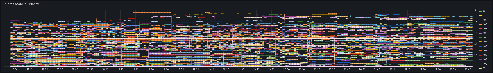

The Agents table above carries the de-beta columns that decide pay: Scored Books, De-beta Eligible, CP Factor, Tether Factor, Skill Rank and Making Share; the full decomposition per miner is on the [Agent Page](#agent-page).  Below the table, one plot follows the score over time and, from 0.6.3, one reads per asset class.

- **De-beta Score (all miners)** - Per-miner de-beta score over time.

- **Asset classes: making weight, makers and making credit** - Per asset class: its effective making weight, the number of makers with credit, and the making credit it carries (right axis).  A single-market simulation shows one class.

### Incentives Plot

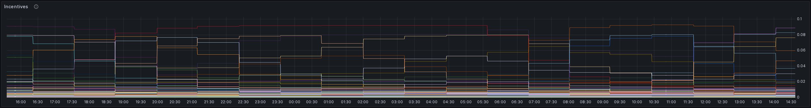

The incentives plot displays a history of the incentive value (as read from the metagraph) per UID.

## Book Page
This page displays overview data for a particular simulated book.  It is most easily accessed by clicking the links in either the Trades or Books table at the Validators page.

### Book Info

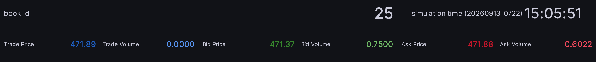

The first two rows display basic information about the selected book.

The unique identifier for the book and the current simulation time are presented in the first row.

The second row shows the latest traded price, the volume traded in latest interval, and the current best bid and ask price levels along with the quantity of open orders present and the best levels.

### Trade Data

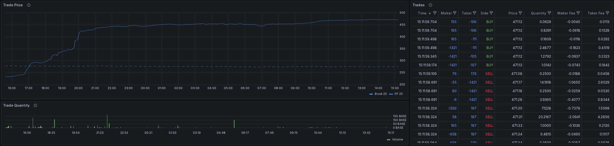

The next row contains information and visualizations related to trading activity in the selected book.

#### Trade Price Plot
The Trade Price plot displays the history of last traded prices for the selected book, along with the fundamental price value.

#### Trade Quantity Plot
The Trade Quantity plot illustrates the total quantity traded in the last interval at the time the trade price was published.

#### Trades Table
The Trades table shows details of the latest 25 trades on each book:

- **Time** - Simulation timestamp of when the trade was executed.

- **Taker** - Agent ID of the taker (the agent whose order removed liquidity), or `BG` when it was a background agent.  Note that clicking on the agent ID here will redirect to the Agent details page for that UID.

- **Maker** - Agent ID of the maker (the agent whose order provided liquidity), or `BG` when it was a background agent.  Note that clicking on the agent ID here will redirect to the Agent details page for that UID.

- **Side** - Direction of the taker's order (BUY or SELL).

- **Price** - Execution price at which the trade occurred.

- **Quantity** - Amount of base asset traded in the transaction.

- **Maker Fee** - Fee charged to or rebate earned by the maker agent (negative value indicates rebate).

- **Taker Fee** - Fee charged to or rebate earned by the taker agent (negative value indicates rebate).

### Orderbook Data

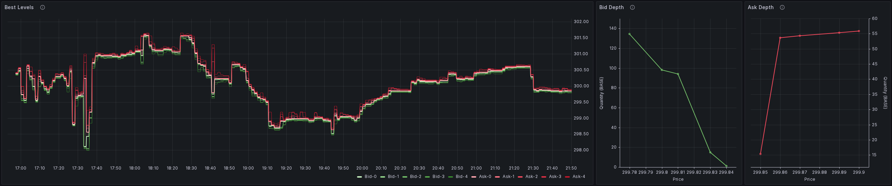

The next row contains visualizations of the orderbook state.

#### Best Levels Plot

This plot displays the prices of the first 5 levels of the book over time.  This allows to inspect the spread size and available liquidity over time.

#### Depth Plots

These plots illustrate the cumulative quantity of orders open among the top 21 levels on each side of the book.  Each dot represents a book level at price indicated on the x-axis, with the y-axis showing how much volume exists up to that level.

### Agents Table

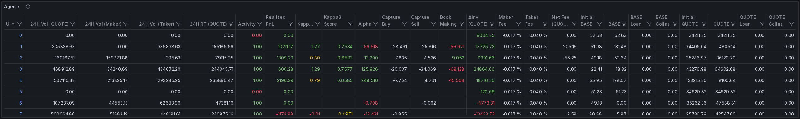

The Agents table at the Book page displays statistics for agents calculated specifically on the selected book:

- **UID** - Miner uid.  Clicking it opens the Agent page for that uid.

- **24H Vol (QUOTE)** - Agent's total trading volume in QUOTE asset over the last 24 simulation hours on the selected book.

- **24H Vol (Maker)** - Agent's maker trading volume (liquidity-providing trades) in QUOTE asset over the last 24 simulation hours on the selected book.

- **24H Vol (Taker)** - Agent's taker trading volume (liquidity-taking trades) in QUOTE asset over the last 24 simulation hours on the selected book.

- **24H RT (QUOTE)** - The agent's total round-tripped volume in QUOTE asset over the last 24 simulation hours for the selected book.

- **Activity** - Activity factor for the book: 1 once the agent has round-tripped on it, 0 before, and above 1 only when the activity impact setting is above 0.  It multiplies the book's normalized Kappa3.

- **Realized PnL** - Realized Profit and Loss from closed positions over the latest assessment window in QUOTE asset for the selected book.

- **Kappa3** - Kappa3 ratio for the selected book.

- **Kappa3 Score** - Kappa3-based score calculated as activity-weighted and normalized Kappa3 ratio for latest assessment period on the selected book.  Published for reference; not in pay since 0.6.2.

- **ΔInv (QUOTE)** - Total change in miner inventory value since the start of simulation or registration of the UID (whichever is more recent).

- **Maker Fee** - Current maker fee rate at the time of observation for the agent on the selected book.

- **Taker Fee** - Current taker fee rate at the time of observation for the agent on the selected book.

- **Net Fee (QUOTE)** - Net fees paid minus rebates earned by the agent on this book, QUOTE; negative means a net rebate.

- **Initial BASE** - Starting balance of BASE asset for this book at simulation start or registration.

- **BASE** - Current balance of BASE asset held by the agent on this book.

- **BASE Loan** - Amount of BASE asset borrowed by the agent on this book.

- **BASE Collat.** - Collateral posted in BASE asset for borrowing on this book.

- **Initial QUOTE** - Starting balance of QUOTE asset for this book at simulation start or registration.

- **QUOTE** - Current balance of QUOTE asset held by the agent on this book.

- **QUOTE Loan** - Amount of QUOTE asset borrowed by the agent on this book.

- **QUOTE Collat.** - Collateral posted in QUOTE asset for borrowing on this book.

- **Sharpe**, **Sharpe Score** - Legacy Sharpe leg, present only on validators older than 0.5.

Four per-book de-beta columns are published while `--scoring.debeta.publish_book_gauges` is on, which is the 0.6.1 default (pass false to drop the roughly 133k series they add):

- **Capture Buy / Capture Sell** - The agent's spread capture on each side of this book versus the centered mid; genuine two-sided making shows both nonzero.

- **Book Making** - `2*min(Capture Buy, Capture Sell)` on this book, before the counterparty discount.  These columns are on the captured basis; from 0.6.3 the making half scales a miner's total by its markout quality, shown on the Agent page.

- **Alpha** - This book's drift-stripped mark-to-market residual feeding the skill leg; it counts only when it clears the skill hurdle.

### De-beta Book Panels

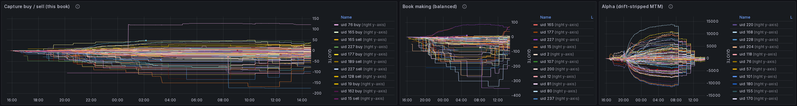

Three per-miner series on the selected book over the Kappa3 window (3 simulated hours by default), published while `--scoring.debeta.publish_book_gauges` is on, which is the 0.6.1 default.  Legend entries are miner uids sorted by the latest value; hover a line for one miner's value.

- **Capture buy / sell (this book)** - Per miner, on this book: spread captured on the maker side of its fills over the skill lookback, in QUOTE.  Buy capture is (mid minus price) times quantity on fills where the miner bought; sell capture is (price minus mid) times quantity where it sold; both against a centred mid over the surrounding 31 prints, so a fill is credited only for what it earned against where the market actually was.  Self-matches earn nothing.

- **Book making (balanced)** - Per miner, on this book: 2 times min(buy capture, sell capture) in QUOTE, the two-sided capture that feeds the making leg before the counterparty discount, on the captured basis.  One-sided flow scores zero here however large.

- **Alpha (drift-stripped MTM)** - Per miner, on this book: the drift-stripped mark-to-market over the skill lookback, in QUOTE.  It is the MTM PnL minus the miner's average inventory times the book's price move over the window, so a position that only rode the drift scores zero.  A book whose alpha is under the skill hurdle does not count toward the skill leg.

### Dynamic Fee Rates Plot

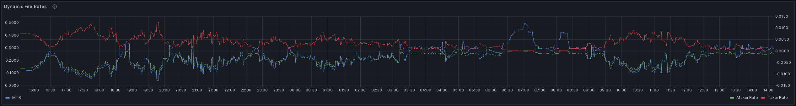

This plot displays a history of the maker and taker fee rates applicable to miner agents in this book on the right y-axis, and the MTR for this book on the left y-axis.

## Agent Page

This page displays detailed statistics for a particular agent over all books for either a specific validator or all validators in the subnet. It is most easily accessed by clicking the links in either the Trades or Agents table at the Validators page.

### Agent Info

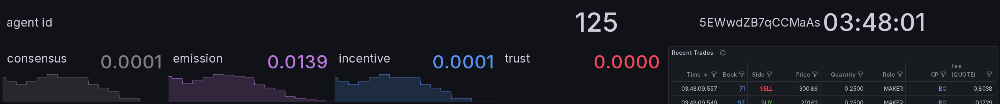

The first two rows display basic information about the selected agent.

The unique identifier for the agent and the current simulation time are presented in the first row.

The second row shows the key metagraph statistics for the agent - consensus, emission, incentive and trust.

### Trades Table

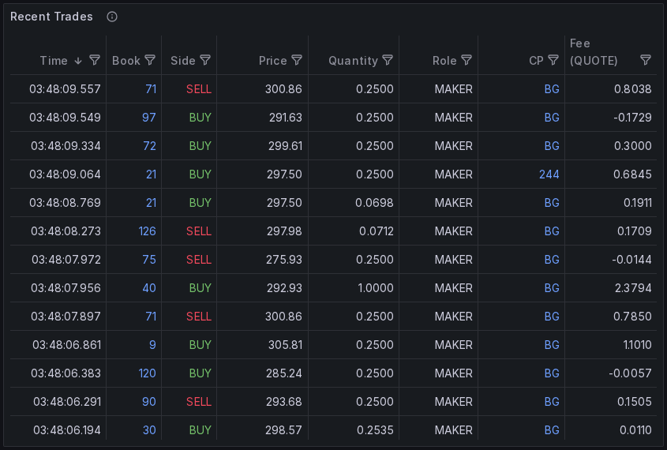

The Trades table sits to the right of the agent info at the top of the page and shows details of the latest 5 trades on each book for the selected agent:

- **Time** - Simulation timestamp of when the trade was executed.

- **Book** - Order book identifier where the trade occurred.  Note that clicking on the book ID here will redirect to the Book details page for that orderbook.

- **Side** - Direction of the taker's order (BUY or SELL).

- **Price** - Execution price at which the trade occurred.

- **Quantity** - Amount of base asset traded in the transaction.

- **Role** - The role of the selected agent in the trade, either maker (providing liquidity with passive order) or taker (taking liquidity with aggressive order).

- **CP** - Counterparty: UID of the agent on the other side of the trade, or `BG` when the other side was a background agent.  Clicking a UID here opens the Agent page for that agent.

- **Fee (QUOTE)** - Fee charged to or rebate earned in the trade by the selected agent.

- **Validator** - Hotkey of the validator in whose simulation the trade took place.

### Score Plot

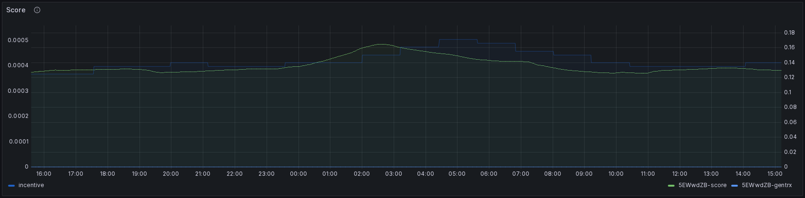

The topmost left plot displays the total score for the agent as assigned by the selected validator(s) on the right y-axis, and the incentive of the agent on the left y-axis.

### Performance Plot

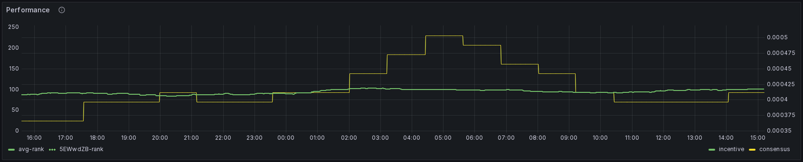

The Performance plot illustrates the ranking in terms of score of the agent over time as assigned by the selected validator(s), as well as an average ranking taken over all selected validators.  The ranking indicates where among the subnet miners this agent places; higher ranking indicates outperformance of others.

### Requests Plot

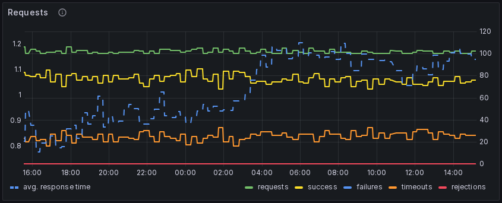

This plot illustrates statistics related to communication with validators; the left hand y-axis shows the average response time of the miner via the dotted blue line, while the right y-axis indicates counts of requests completed with different status:

- **Requests** - Total count of requests received in the observation window.
- **Success** - Responses successfully received by validators from the selected miner.
- **Failures** - Responses which failed to be received by the validator due to reasons other than timeout (e.g. network configuration issue).
- **Timeouts** - Responses not received by the validator due to exceeding the response timeout.
- **Rejections** - Responses not sent to validator due to blacklisting rules.

### GenTRX Plots

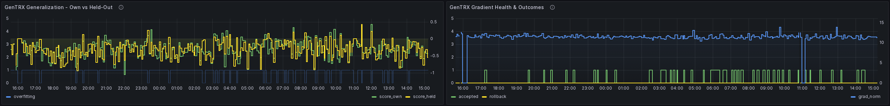

The Agent page also surfaces the selected miner's per-round GenTRX outcomes alongside the trading metrics.  The dedicated [GenTRX Page](#gentrx-page) covers the network-wide training state.

- **GenTRX Generalization - Own vs Held-Out** - For the selected agent, per-round own-data and held-out validation scores.  `score_own` is the gradient's improvement on the miner's own training data; `score_held` is its improvement on a held-out shard the miner never sees.  A persistent gap (own much larger than held) means the gradient is over-fitting; the `overfitting` series flags rounds where the validator detected this.

- **GenTRX Gradient Health & Outcomes** - For the selected agent, per-round gradient outcomes.  `accepted` flags rounds whose gradient cleared the score threshold and was applied this round; `rollback` flags rounds where this gradient was selected during a rollback; `grad_norm` is the L2 norm of the submitted gradient, useful for spotting collapsing or exploding gradients.

### Daily Volume Plot

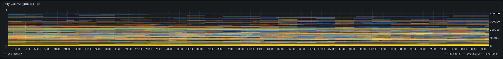

Average over the selected validators of the volume traded by the agent over the last 24 simulation hours, in total and split by maker and taker role, per book and summed.  The agent's activity factor is plotted alongside, on average and per book: 1 once the agent has round-tripped on a book, 0 before, and above 1 only when the activity impact setting is above 0.  The dashed red line is the 24 h volume cap: once an agent's traded volume on a book exceeds it, its further instructions on that book are dropped for the rest of the window.

### Round-Trip Volume Plot

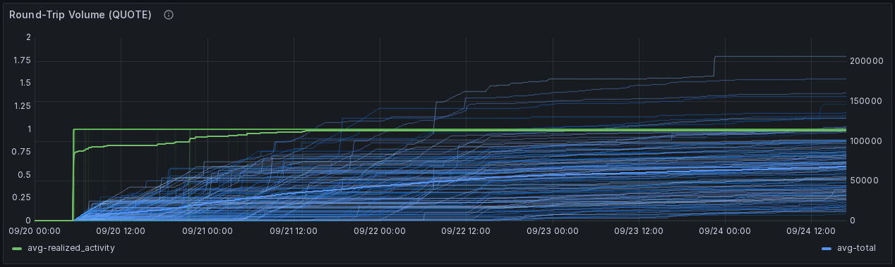

Average over the selected validators of the volume the agent round-tripped (opened and closed a position, realizing a profit or loss) over the last 24 simulation hours, per book and summed.  The activity factor that multiplies the agent's per-book Kappa3 is plotted alongside, on average and per book.

### Realized PnL Plot

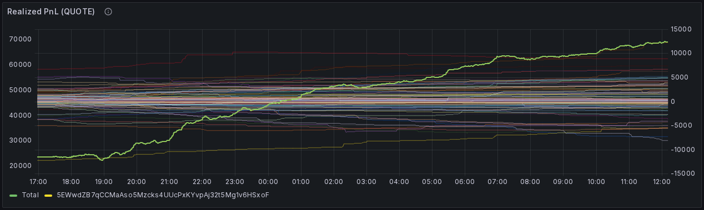

Realized PnL of the agent over the Kappa3 window (the last 3 simulated hours by default), from round-tripped trades: price difference plus fees and rebates, in QUOTE.

### De-beta Scoring

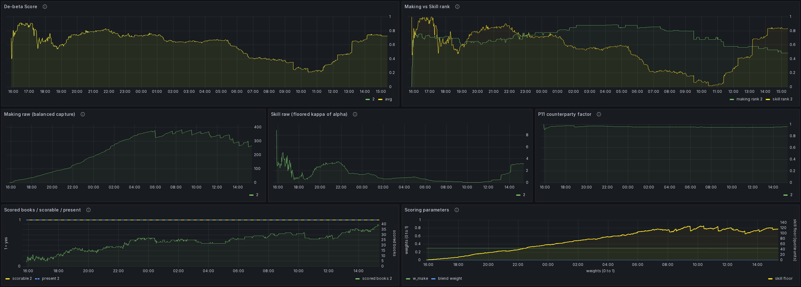

The de-beta decomposition of the agent's score, in seven panels.

- **De-beta score and its two legs** - The score in bold, with the two ranked legs it is built from: `w_make x rank+(making) + (1 - w_make) x rank+(skill)`.  The legs recombine exactly to the score.  Dashed: the agent's making and skill ranks within each asset class, from the class run the pools are built from; they follow the asset-class selector.

- **Eligibility and factors: presence, coverage, counterparty, tether** - Whether the agent is scorable and present this cycle, its presence share over the query window, the skill coverage factor, the counterparty factor and, from 0.6.3, the tether factor with the background market's share of its fill volume beside it.  All are bounded 0 to 1; 1.0 is no discount.  Dashed: the counterparty, tether and coverage factors and the background share within each asset class; they follow the asset-class selector.

- **Making credit: paid, realized and captured** - The making credit the agent is paid on, after the counterparty factor and the tether, in bold; beside it the credit on each basis, captured (the spread at the moment of the fill) and realized (the spread its fills still hold 20 simulation seconds later).  From 0.6.3 the paid credit is the captured credit scaled by the ratio of the two, held between 0 and 1.  Dashed: the making credit within each asset class, as the class pool reads it; it follows the asset-class selector.

- **Skill: kappa, net alpha and notional** - The agent's floored kappa, the consistency of its alpha across qualifying books; its net alpha, which the skill half pays in proportion to; and the traded notional behind those books, which the skill hurdle (`scoring.debeta.skill_hurdle_bps`) reads.

- **Books filled vs books scored** - Books the agent filled in, which the coverage rule reads, against books whose alpha cleared the hurdle, which the skill bar counts.  Breadth and size per book are different things: an agent can fill many books and have few qualify.  Dashed: books filled, books scored and notional within each asset class, and each class's skill bar in red from the class summaries; they follow the asset-class selector.

- **Pool pay: making share and ladder input** - The agent's share of the making half on the left; on the right the score entering the Pareto ladder, which pays the skill half only in a cycle where no miner qualifies for it.

- **Scoring parameters** - The `w_make`, skill floor and De-beta Weight values the validator applied that cycle and, from 0.6.3, which making basis pays (1 = realized).

### Unrealized Profit & Loss Plots

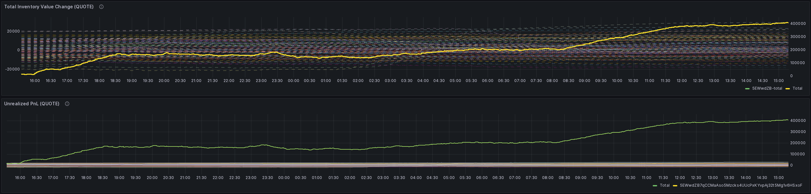

The unrealized PnL (change in total inventory value) achieved by the agent since the start of the simulation or its registration, for each book as well as in total.
The profit and loss (change in inventory value) achieved by the agent over the Kappa3 window (the last 3 simulated hours by default), for each book individually and in total.

### Last Fee Rate

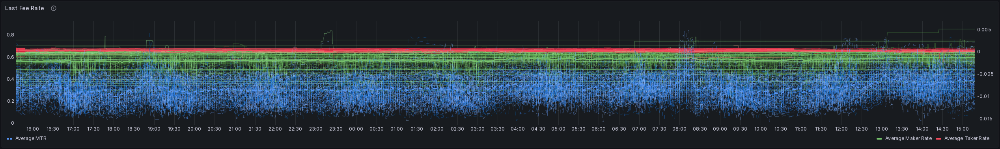

This plot displays a history of the fee rates paid by the agent in their most recent trade on each book and on average across books.  The average and per-book MTR is also plotted.

### Balances Plots

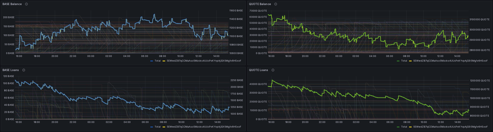

Current balance of BASE asset held by the agent, plotted per book and as a total across all books.
Current balance of QUOTE asset held by the agent, plotted per book and as a total across all books.
Quantity of BASE borrowed by the agent via leveraged orders, plotted per book and as a total across all books.
Quantity of QUOTE borrowed by the agent via leveraged orders, plotted per book and as a total across all books.

## GenTRX Page

This page surfaces the state and health of the GenTRX distributed-training workload: the model-training side of incentive that runs alongside trading-simulation scoring.  Each round, validators score gradients submitted by miners, aggregate those that improve the held-out loss, and roll back if a round regresses.

### Status

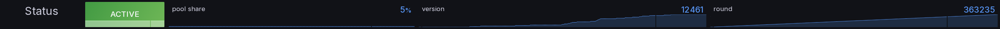

The top of the page summarises the current state of the training run.  The first row reports validator-side configuration and round counters; the second row tracks per-round miner participation through the pipeline.

- **GenTRX Status** - Whether GenTRX training is active.  Red = inactive; submitted gradients will not be scored.

- **Pool Share** - Fraction of validator scoring weight allocated to GenTRX.  Higher = a larger share of incentive comes from training.

- **Checkpoint Version** - Current model checkpoint version. Increments when a round is accepted.  Train against this version to avoid version-mismatch rejections.

- **Aggregation Round** - Current round number.  One round is one scoring + aggregation cycle.

### Miners

- **Active Miners** - Miners currently assigned a GenTRX gradient slot.

- **Delivered** - Fraction of assigned miners that fetched their assignment from the validator (`GET /gentrx/assignment`).  Low values point at miners not polling for work; this is the validator → miner direction, not the gradient submission.

- **Scored** - Fraction of assigned miners whose gradient reached the validator, parsed cleanly, and completed scoring without error.  Drops here mean upload, parse, or scoring failures; check gradient format and round version.

- **Accepted** - Fraction of assigned miners whose gradient cleared the score threshold and was applied to the model (`n_accepted / n_assigned`).  This is the end-to-end yield of the round; only this group earns reward this round.

### Training Progress

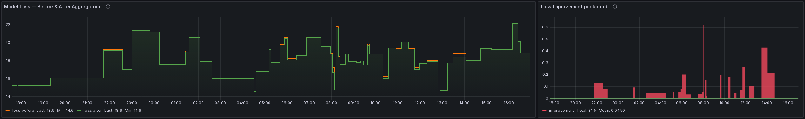

Two timeseries plots tracking model improvement and rollbacks across rounds.

- **Model Loss: Before and After Aggregation** - Held-out loss before (orange) and after (green) each round's accepted gradients.  The gap is per-round improvement.  When the lines converge, training is plateauing and higher-quality gradients are needed.

- **Loss Improvement per Round** - Per-round change in held-out loss.  Green bars = the round helped, red = rollback.

### Per-Miner Performance

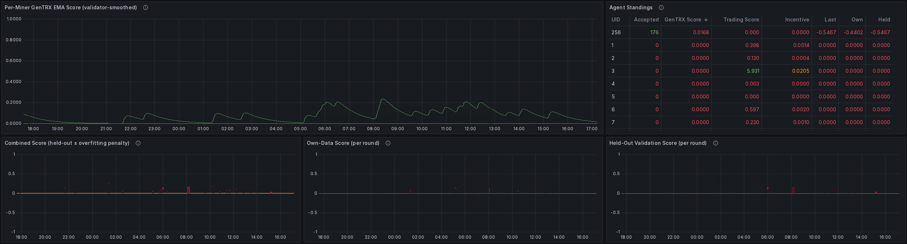

Per-miner scoring detail.  Series-line panels show the top 10 by current value; use the **Agent / UID** selector at the top of the page to focus on a specific miner.

- **Per-Miner GenTRX EMA Score** - EMA-smoothed GenTRX reward per miner.  This is the value the validator sets on-chain.  Range 0–1 after rank normalisation.

- **Agent Standings** - Per-agent table summarising GenTRX participation and reward over the current dashboard time window.
  - **UID** - Miner uid.
  - **Accepted** - Count of accepted rounds in the current dashboard time window.
  - **GenTRX Score** - EMA-smoothed GenTRX training reward, rank-normalised in [0, 1]; drives the GenTRX share of on-chain weight.
  - **Trading Score** - EMA-smoothed trading reward after the Pareto distribution; compare miners by rank within this column.
  - **Incentive** - Current on-chain emission share from the metagraph, [0, 1]; lags the weight set by one period.
  - **Last** - Combined per-round GenTRX score of the most recent scoring cycle (raw loss delta; positive improved the model).
  - **Own** - Per-round loss delta on the miner's own training data.
  - **Held** - Per-round loss delta on the held-out shard the miner never sees.

- **Combined Score (held-out ± overfitting penalty)** - Per-round combined score per miner.  Built from held-out loss improvement with a penalty applied when the gradient over-fit to the miner's own data.  This is what feeds the EMA reward.

- **Own-Data Score** - Per-round score on each miner's own training data.  Positive = the gradient improved the model on data the miner has seen.  Negative = the gradient did not even fit its own data.

- **Held-Out Validation Score** - Per-round score on a held-out shard the miner never sees.  The generalisation signal.  If held is much lower than own-data, the miner is over-fitting.

### Diagnostics

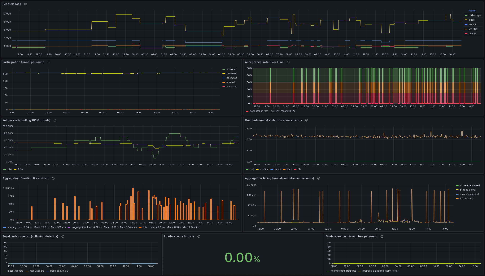

Lower-level diagnostics for troubleshooting training health and validator-side latency.

- **Per-field loss** - Cross-entropy loss per output field: order type, price, quantity (`vol_int`, `vol_dec`), time interval.  Persistently flat-high fields are underfit; gradients that move those fields are more valuable.

- **Participation funnel per round** - Round attrition through the pipeline.  `assigned` = chosen at round start; `delivered` = fetched their assignment; `collected` = gradient received and parsed by the validator; `scored` = scoring ran without error.

- **Acceptance Rate Over Time** - Acceptance rate (`n_accepted / n_scored`) over time.  Red zone (<30%): few of the gradients that reached scoring are clearing the threshold.  Green (>60%): healthy throughput.

- **Rollback rate (rolling 10/50 rounds)** - Rolling rollback rate over the last 10 and 50 rounds.  Persistent high values mean recent accepted gradients are not actually helping; reward density is lower in this regime.

- **Gradient-norm distribution across miners** - Distribution of miners' gradient L2 norms each round (min / median / mean / max / std).  Outliers in min or max often correlate with rejected gradients; aim for the median.

- **Aggregation Duration Breakdown** - Per-round validator latency: scoring (blue), aggregation + validation (purple), total (orange).  All in seconds.  Affects how quickly the next round opens.

- **Aggregation timing breakdown (stacked seconds)** - Stacked breakdown of where each round's time is spent on the validator (scoring, proposal eval, checkpoint save, loader build).  Does not affect scoring directly.

- **Top-k index overlap (collusion detector)** - Pairwise overlap between miners' top-k gradient indices.  High mean overlap can flag coordinated or copied gradients across miners.

- **Loader-cache hit rate** - Validator-side hit rate for the held-out data loader cache.  Affects round latency only; does not change scoring.

- **Model-version mismatches per round** - Submitted gradients each round that targeted a stale checkpoint version and were therefore discarded.  If non-zero, ensure you pull the latest checkpoint before each training round.